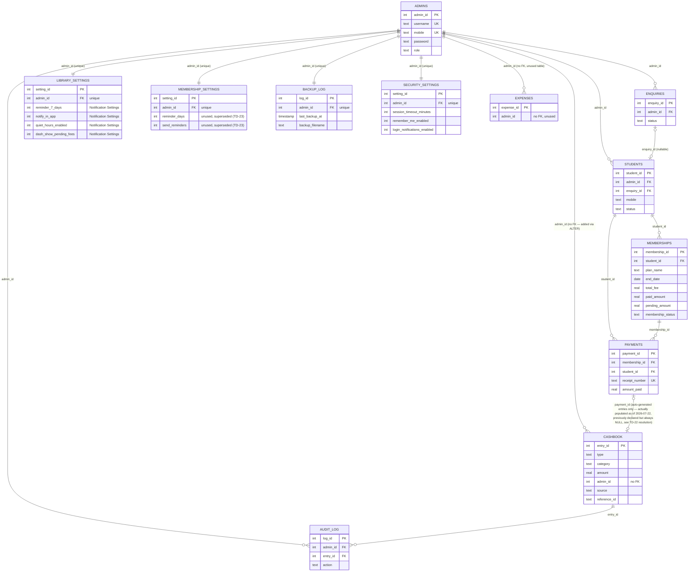
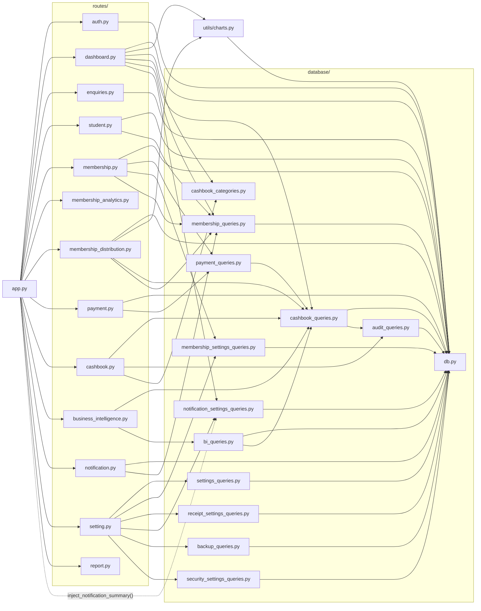

# Diagrams

Five Mermaid diagrams (render natively on GitHub). Each is generated from the actual code — if a route, table, or import changes, update the matching diagram in the same change. These are single-source-of-truth here; other docs link to this file rather than re-embedding copies, so there's only one place to keep in sync.

## 1. Folder structure

```mermaid
graph TD
    Root["Smart Library App/"]
    Root --> AppPy["app.py"]
    Root --> ConfigPy["config.py (unused)"]
    Root --> Requirements["requirements.txt"]
    Root --> ReadmeRoot["README.md (empty)"]
    Root --> ClaudeMd["CLAUDE.md"]
    Root --> Database["database/"]
    Root --> Routes["routes/"]
    Root --> Templates["templates/"]
    Root --> Static["static/"]
    Root --> Utils["utils/"]
    Root --> Docs["docs/"]
    Root --> Empty["models/ services/ reports/ tests/ backups/ .agents/ (all empty)"]

    Database --> DBCore["db.py, schema.sql, seed.py"]
    Database --> DBMigrations["migrate_*.py (11 scripts, no version tracking)"]
    Database --> DBQueries["*_queries.py + cashbook_categories.py (10 modules)"]
    Database --> DBFile[("library.db")]

    Routes --> RouteFiles["13 blueprint modules, see FILE_REFERENCE.md"]

    Templates --> Layouts["layouts/ (base, auth_base, navbar, sidebar)"]
    Templates --> Components["components/ (~45 shared partials)"]
    Templates --> FeatureDirs["auth/ dashboard/ enquiries/ students/ memberships/ payments/ cashbook/ business_intelligence/ notification/ settings/ reports/"]

    Static --> CSS["css/ (6 files)"]
    Static --> JS["js/ (7 files)"]
    Static --> Charts["charts/ (3 server-generated PNGs)"]
    Static --> Uploads["uploads/settings/ (per-admin branding)"]
    Static --> Images["images/ (empty)"]
```



## 2. Application architecture (layered)

```mermaid
graph TD
    Browser["Browser"] --> Flask["app.py: create_app()"]

    Flask --> Auth["routes/auth.py"]
    Flask --> Dashboard["routes/dashboard.py"]
    Flask --> Enquiries["routes/enquiries.py"]
    Flask --> Student["routes/student.py"]
    Flask --> Membership["routes/membership.py"]
    Flask --> MembershipAnalytics["routes/membership_analytics.py"]
    Flask --> MembershipDistribution["routes/membership_distribution.py"]
    Flask --> Payment["routes/payment.py"]
    Flask --> Cashbook["routes/cashbook.py"]
    Flask --> BI["routes/business_intelligence.py"]
    Flask --> Notification["routes/notification.py"]
    Flask --> Setting["routes/setting.py"]
    Flask --> Report["routes/report.py"]
    Flask -. "context_processor: inject_notification_summary (every page render)" .-> Notification

    subgraph DataAccess ["Data Access Layer (database/)"]
        DB["db.py — get_connection()"]
        AuditQ["audit_queries.py"]
        BiQ["bi_queries.py"]
        CashQ["cashbook_queries.py"]
        MemSettQ["membership_settings_queries.py"]
        SettQ["settings_queries.py"]
        ReceiptSettQ["receipt_settings_queries.py"]
        NotifSettQ["notification_settings_queries.py"]
        BackupQ["backup_queries.py"]
        SecSettQ["security_settings_queries.py"]
        CatConst["cashbook_categories.py (constants only)"]
    end

    Charts["utils/charts.py (matplotlib)"]

    Auth --> DB
    Dashboard --> DB
    Dashboard --> Charts
    Dashboard --> CatConst
    Dashboard --> NotifSettQ
    Enquiries --> DB
    Student --> DB
    Membership --> DB
    Membership --> CashQ
    MembershipDistribution --> DB
    MembershipDistribution --> Charts
    Payment --> DB
    Payment --> CashQ
    Cashbook --> CashQ
    Cashbook --> AuditQ
    Cashbook --> CatConst
    BI --> CashQ
    BI --> BiQ
    Notification --> DB
    Setting --> SettQ
    Setting --> MemSettQ
    Setting --> ReceiptSettQ
    Setting --> NotifSettQ
    Setting --> BackupQ
    Setting --> SecSettQ
    app_ctx["app.py: inject_notification_summary()"] --> NotifSettQ

    CashQ --> AuditQ
    CashQ --> DB
    BiQ --> CashQ
    BiQ --> DB
    AuditQ --> DB
    ReceiptSettQ --> DB
    NotifSettQ --> DB
    BackupQ --> DB
    SecSettQ --> DB
    MemSettQ --> DB
    SettQ --> DB
    Charts --> DB

    DB --> SQLite[("library.db (SQLite)")]

    Auth -.->|render_template| Templates["Jinja templates → static PNGs / Chart.js JSON"]
    Dashboard -.->|render_template| Templates
    Cashbook -.->|render_template| Templates
    BI -.->|render_template| Templates
```



## 3. Request flow (Browser → Route → Database → Template)

```mermaid
sequenceDiagram
    participant B as Browser
    participant R as Flask route (routes/*.py)
    participant Q as Query module / raw SQL
    participant D as SQLite (library.db)
    participant T as Jinja template

    B->>R: HTTP request (e.g. GET /cashbook/)
    R->>R: if "admin_id" not in session: redirect("/")
    alt not logged in
        R-->>B: 302 redirect to "/"
    else logged in
        R->>Q: query function(admin_id, ...)
        Q->>D: SQL SELECT / INSERT / UPDATE
        D-->>Q: rows / rowcount
        Q-->>R: Python dict / list / sqlite3.Row
        opt write flow (membership/payment) — as of 2026-07-22, all three routes
        (membership.create, membership.renew, payment.collect) go through the
        same helper instead of each inlining this sequence
            R->>Q: record_payment(conn, admin_id, ...) [database/payment_queries.py]
            Q->>D: UPDATE library_settings SET next_receipt_number += 1
            Q->>D: INSERT INTO payments (receipt_number, ...)
            Q->>Q: insert_income_entry(conn, admin_id, ..., payment_id=payments.lastrowid)
            Q->>D: INSERT INTO cashbook (..., payment_id)
            Q->>Q: log_entry(cursor, ...) — same transaction
            D-->>Q: commit (all-or-nothing) / rollback on sqlite3.Error
        end
        R->>T: render_template(name, **context)
        T->>T: extends layouts/base.html, includes components/*
        T-->>R: rendered HTML
        R-->>B: 200 response
    end
```

## 4. Database relationships



`settings` (legacy) and `transactions` (defined twice, see [04_DATABASE_SCHEMA.md](04_DATABASE_SCHEMA.md)) are omitted here since neither is used by any route today — see [11_FUTURE_WORK.md](11_FUTURE_WORK.md) TD-2/TD-4.

## 5. Module dependency graph (literal Python imports, verified by grep on 2026-07-20, updated 2026-07-21 for `database/membership_queries.py`, updated 2026-07-22 for `database/payment_queries.py`)



`membership_analytics.py` and `report.py` have no data-layer imports (both are stubs — see [11_FUTURE_WORK.md](11_FUTURE_WORK.md)). Migration scripts (`database/migrate_*.py`) are omitted — they're standalone-run, not part of the request-time import graph; see their individual cards in [FILE_REFERENCE.md](FILE_REFERENCE.md) for their (inconsistent) import style.
