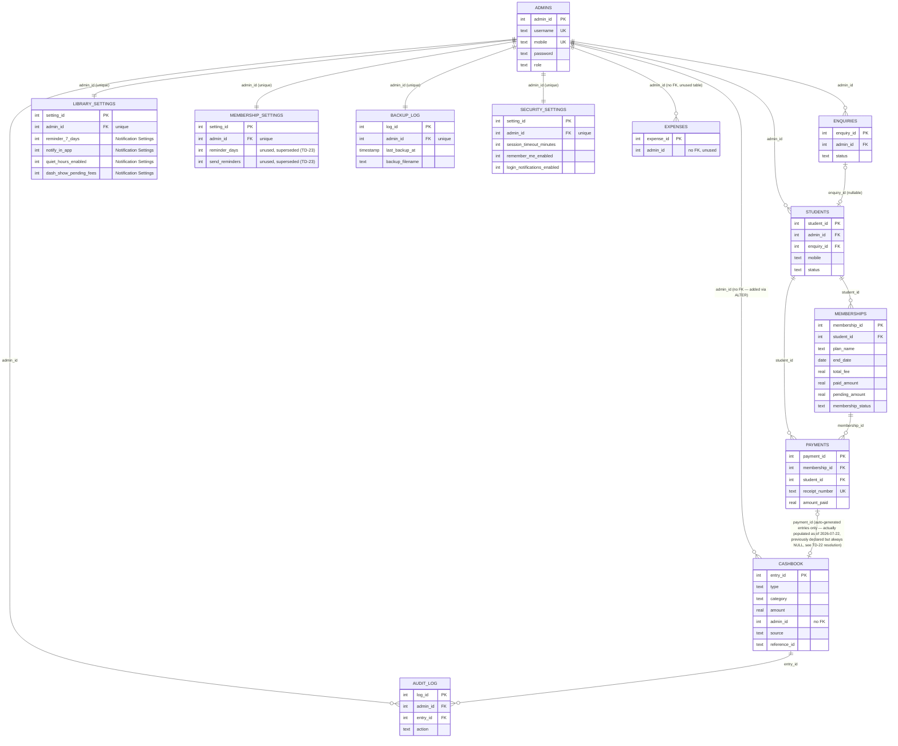
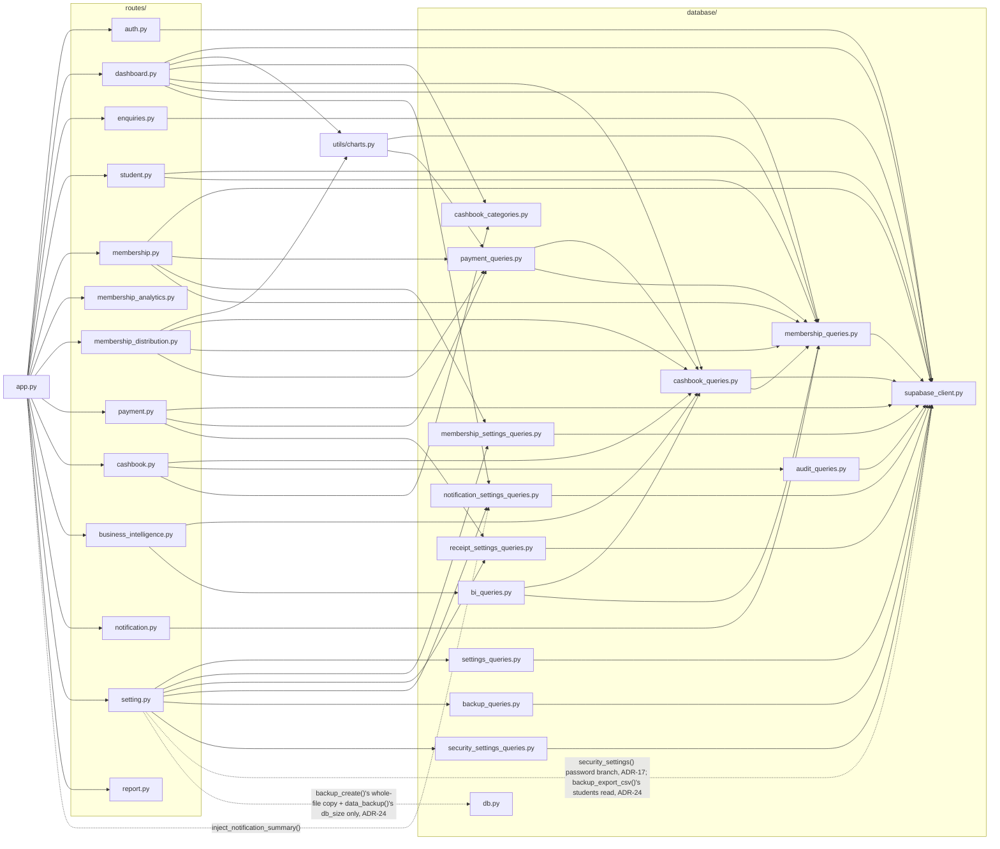

# Diagrams

Five Mermaid diagrams (render natively on GitHub). Each is generated from the actual code — if a route, table, or import changes, update the matching diagram in the same change. These are single-source-of-truth here; other docs link to this file rather than re-embedding copies, so there's only one place to keep in sync.

## 1. Folder structure

```mermaid
graph TD
    Root["Smart Library App/"]
    Root --> AppPy["app.py"]
    Root --> ConfigPy["config.py"]
    Root --> Requirements["requirements.txt"]
    Root --> ReadmeRoot["README.md (empty)"]
    Root --> ClaudeMd["CLAUDE.md"]
    Root --> Database["database/"]
    Root --> Routes["routes/"]
    Root --> Templates["templates/"]
    Root --> Static["static/"]
    Root --> Utils["utils/"]
    Root --> Docs["docs/"]
    Root --> Empty["models/ services/ reports/ tests/ backups/ .agents/ (all empty)"]

    Database --> DBCore["db.py, schema.sql, seed.py"]
    Database --> DBMigrations["migrate_*.py (11 scripts, no version tracking)"]
    Database --> DBQueries["*_queries.py + cashbook_categories.py (10 modules)"]
    Database --> DBFile[("library.db")]

    Routes --> RouteFiles["13 blueprint modules, see FILE_REFERENCE.md"]

    Templates --> Layouts["layouts/ (base, auth_base, navbar, sidebar)"]
    Templates --> Components["components/ (~45 shared partials)"]
    Templates --> FeatureDirs["auth/ dashboard/ enquiries/ students/ memberships/ payments/ cashbook/ business_intelligence/ notification/ settings/ reports/"]

    Static --> CSS["css/ (6 files)"]
    Static --> JS["js/ (7 files)"]
    Static --> Charts["charts/ (3 server-generated PNGs)"]
    Static --> Uploads["uploads/settings/ (per-admin branding)"]
    Static --> Images["images/ (empty)"]
```

## 2. Application architecture (layered)

```mermaid
graph TD
    Browser["Browser"] --> Flask["app.py: create_app()"]

    Flask --> Auth["routes/auth.py"]
    Flask --> Dashboard["routes/dashboard.py"]
    Flask --> Enquiries["routes/enquiries.py"]
    Flask --> Student["routes/student.py"]
    Flask --> Membership["routes/membership.py"]
    Flask --> MembershipAnalytics["routes/membership_analytics.py"]
    Flask --> MembershipDistribution["routes/membership_distribution.py"]
    Flask --> Payment["routes/payment.py"]
    Flask --> Cashbook["routes/cashbook.py"]
    Flask --> BI["routes/business_intelligence.py"]
    Flask --> Notification["routes/notification.py"]
    Flask --> Setting["routes/setting.py"]
    Flask --> Report["routes/report.py"]
    Flask -. "context_processor: inject_notification_summary (every page render)" .-> Notification

    subgraph DataAccess ["Data Access Layer (database/)"]
        DB["db.py — get_connection()"]
        AuditQ["audit_queries.py"]
        BiQ["bi_queries.py"]
        CashQ["cashbook_queries.py"]
        PaymentQ["payment_queries.py"]
        MembershipQ["membership_queries.py"]
        MemSettQ["membership_settings_queries.py"]
        SettQ["settings_queries.py"]
        ReceiptSettQ["receipt_settings_queries.py"]
        NotifSettQ["notification_settings_queries.py"]
        BackupQ["backup_queries.py"]
        SecSettQ["security_settings_queries.py"]
        CatConst["cashbook_categories.py (constants only)"]
    end

    Charts["utils/charts.py (matplotlib)"]
    SupabaseClient["database/supabase_client.py — get_supabase_client()"]

    Auth --> SupabaseClient
    Auth -.->|"register() only — SQLite mirror-insert bridge, TD-35"| DB
    Dashboard --> MembershipQ
    Dashboard --> SupabaseClient
    Dashboard --> Charts
    Dashboard --> CatConst
    Dashboard --> NotifSettQ
    Dashboard --> CashQ
    Enquiries --> SupabaseClient
    Student --> SupabaseClient
    Student --> MembershipQ
    Membership --> SupabaseClient
    Membership --> CashQ
    Membership --> PaymentQ
    MembershipDistribution --> MembershipQ
    MembershipDistribution --> Charts
    MembershipDistribution --> CashQ
    MembershipDistribution --> PaymentQ
    Payment --> SupabaseClient
    Payment --> PaymentQ
    Payment --> CashQ
    Payment --> ReceiptSettQ
    Cashbook --> CashQ
    Cashbook --> AuditQ
    Cashbook --> CatConst
    BI --> CashQ
    BI --> BiQ
    Notification --> MembershipQ
    Setting --> SettQ
    Setting --> MemSettQ
    Setting --> ReceiptSettQ
    Setting --> NotifSettQ
    Setting --> BackupQ
    Setting --> SecSettQ
    Setting -.->|"security_settings() password branch, ADR-17; backup_export_csv()'s students read, ADR-24"| SupabaseClient
    Setting -.->|"backup_create()'s whole-file copy + data_backup()'s db_size only, ADR-24"| DB
    app_ctx["app.py: inject_notification_summary()"] --> NotifSettQ

    CashQ --> SupabaseClient
    CashQ --> MembershipQ
    PaymentQ --> SupabaseClient
    PaymentQ --> CashQ
    PaymentQ --> MembershipQ
    AuditQ --> SupabaseClient
    BiQ --> CashQ
    BiQ --> MembershipQ
    MembershipQ --> SupabaseClient
    ReceiptSettQ --> SupabaseClient
    NotifSettQ --> SupabaseClient
    BackupQ --> SupabaseClient
    SecSettQ --> SupabaseClient
    MemSettQ --> SupabaseClient
    SettQ --> SupabaseClient
    Charts --> MembershipQ
    Charts --> PaymentQ

    DB --> SQLite[("library.db (SQLite)")]
    SupabaseClient --> SupabaseDB[("Supabase (PostgreSQL) — admins, enquiries, students, memberships, payments, cashbook, audit_log, library_settings, membership_settings, backup_log, security_settings")]

    Auth -.->|render_template| Templates["Jinja templates → static PNGs / Chart.js JSON"]
    Dashboard -.->|render_template| Templates
    Cashbook -.->|render_template| Templates
    BI -.->|render_template| Templates
```

As of 2026-07-23 (ADR-16), `routes/auth.py` is the first module cut over off SQLite — `admins` reads/writes for login/register/forgot-password go through `database/supabase_client.py` to Supabase (PostgreSQL) instead of `database/db.py`'s SQLite connection. `register()` is the one exception: it also mirror-inserts the same new admin row into SQLite (dashed edge above), because (originally) 7 tables — `enquiries`, `students`, `audit_log`, `library_settings`, `membership_settings`, `backup_log`, `security_settings` — still enforced real SQLite foreign keys back to `admins.admin_id`; as of 2026-07-24 (ADR-24) the last 4 dropped off this list entirely, leaving only `enquiries`/`students`/`audit_log` — this bridge is temporary scaffolding, not permanent design (TD-35). As of the same day (ADR-17), `routes/setting.py`'s `security_settings()` password-change branch also uses `SupabaseClient` for `admins.password` (dashed edge above, scoped to that one branch) — `admins.password` now has a single writer again across `forgot_password()` and `security_settings()`, closing TD-35's password split-brain (now `Resolved`). Every other function in `routes/setting.py` was still 100% SQLite at that point — see ADR-24 below for how that changed. Also as of 2026-07-23 (ADR-18), `routes/enquiries.py` became the second full-table cutover — `enquiries` reads/writes go through `SupabaseClient`, Supabase is the source of truth for the Enquiries pages, and `DB` (dashed edge above) is now only a write-synced mirror that `add()`/`edit()`/`delete()` keep current so `routes/student.py`'s `admission()` can keep working against a real SQLite FK. Immediately after (ADR-19), `routes/student.py` became the third full-table cutover — `students` reads/writes go through `SupabaseClient` too, Supabase is the source of truth for the Students pages, and `admission()`'s `enquiries.status = 'Admitted'` write now targets Supabase directly (closing TD-36, `Resolved`) instead of the SQLite mirror only. `DB` remains a write-synced mirror for `students` (kept current by `admission()`/`edit()`) purely because `routes/membership.py`/`routes/payment.py`/`routes/dashboard.py`/`routes/membership_distribution.py`/`routes/notification.py`/`routes/setting.py`'s backup functions, and `database/bi_queries.py`/`cashbook_queries.py`/`membership_queries.py` (all still unmigrated) run raw `JOIN students` queries directly against SQLite. As of the same day (ADR-20), `routes/membership.py` became the fourth full-table cutover — `memberships` reads/writes for `index()`/`create()`/`renew()` go through `SupabaseClient`, Supabase is the source of truth, and `database/membership_queries.py`'s `get_active_membership()` (membership.py's own duplicate-active-membership guard, its only caller) reads Supabase too. `DB` remains a write-synced mirror for `memberships` (kept current by `create()`/`renew()`, and now also by `routes/payment.py`'s `collect()`, see below) purely because `routes/dashboard.py`, `routes/membership_distribution.py`, `routes/notification.py`, `routes/student.py`'s `view()`, and `database/cashbook_queries.py`'s `get_pending_fees()`/`database/bi_queries.py` (all still unmigrated) run raw `JOIN memberships` queries directly against SQLite — `database/membership_queries.py`'s other exports (`EFFECTIVE_STATUS_SQL`/`DAYS_LEFT_SQL`/`get_membership_counts`/`get_effective_status`), still SQL/SQLite-backed, are what those modules keep calling. Also as of 2026-07-23 (ADR-21), `routes/payment.py` became the fifth full-table cutover — `collect()` now reads/updates `memberships.paid_amount`/`pending_amount` in Supabase first (the source of truth `routes/membership.py`'s `index()` reads), then mirrors the identical update into `DB` (dashed edge above) for the still-unmigrated modules listed above, closing **TD-37** (`Resolved`) — Supabase and the SQLite mirror no longer disagree about a membership's balance after a payment is collected. `index()` is unchanged and still reads `payments`/`students` from `DB` — neither is part of this cutover. Also as of 2026-07-23 (ADR-22), `database/cashbook_queries.py` (`CashQ`) and `database/audit_queries.py` (`AuditQ`) became the sixth/seventh full-table cutover — every read now goes through `SupabaseClient`, source of truth for `cashbook`/`audit_log`. Unlike every prior slice, this one has two different write shapes: manual entries (`insert_transaction()`, called from `Cashbook`) write Supabase first and roll back the SQLite mirror-write on failure, the same strict shape as `Enquiries`/`Student`/`Membership`; automatic entries (`insert_income_entry()`, called transitively from `Membership`/`Payment` via `database/payment_queries.py`'s `record_payment()`) keep the SQLite write as primary, unchanged, and best-effort mirror into Supabase, since that caller chain is out of scope and can't be given a new caught exception type — `payment_id` is never sent to Supabase for those rows, since Supabase enforces a live FK to the still-SQLite-only `payments` table (TD-38/TD-39). `AuditQ`'s `log_entry()` itself was completely unchanged at that point, a pure SQLite mirror-write with zero application readers — kept only to satisfy `audit_log`'s SQLite FKs. Also as of 2026-07-23 (ADR-23), the analytics layer — `Dashboard`, `Notification`, `MembershipDistribution`, `BiQ`, and two of `Charts`' three chart functions — cut over to Supabase for their `students`/`memberships` reads, via a new shared helper, `MembershipQ`'s `get_memberships_for_admin()`/`get_admin_students()` (`MembershipQ` itself now has no SQLite dependency left — `get_membership_counts()` moved to Supabase alongside the already-Supabase `get_active_membership()`). `CashQ`'s `get_pending_fees()` moved the same way. `Notification` now has zero SQLite dependency at all; `Dashboard`/`MembershipDistribution`/`CashQ`/`Charts` each keep exactly one narrow `DB` edge for their remaining `payments`-only reads (dashed edges above), since `payments` itself is not part of this slice. Also as of 2026-07-24 (ADR-24), `Setting`'s six delegated-to query modules (`SettQ`, `MemSettQ`, `ReceiptSettQ`, `NotifSettQ`, `BackupQ`, `SecSettQ`) all cut over to `SupabaseClient`, with **no SQLite mirror kept at all** — unlike every table above, these four (`library_settings`/`membership_settings`/`backup_log`/`security_settings`, `ReceiptSettQ`/`NotifSettQ` both operating on the same `library_settings` row as `SettQ`) are leaf nodes with nothing downstream requiring their SQLite row to keep existing, so this was a one-step cutover rather than an ongoing mirror. `Setting`'s own `backup_export_csv()` also moved its `students` read to `SupabaseClient` in the same slice; `backup_create()`'s whole-file SQLite snapshot and `data_backup()`'s `db_size` display are the only `DB` edges left in this route. This shrank `register()`'s bridge (see above) from 7 dependents to 3. Also as of 2026-07-24 (ADR-25), `PaymentQ` (`database/payment_queries.py`) became the eighth full-table cutover — `get_payments_for_admin()` reads Supabase `payments`/`students` (used by `Payment`'s `index()`, `MembershipDistribution`'s per-row receipt columns, and `Charts`' `generate_revenue_chart()`, all migrated in the same slice), and `record_payment()` keeps its SQLite write as primary, unchanged, best-effort mirroring the identical row into Supabase afterward (the same shape ADR-22 established for `CashQ`'s `insert_income_entry()`). Since `payments` now has a Supabase row, `insert_income_entry()` also starts sending a real `payment_id` to Supabase `cashbook` (closing **TD-38**'s common case). `Student`'s `view()` and `CashQ`'s `get_today_fee_collection()`/`get_total_fee_revenue()` moved to Supabase in the same slice. This is the first slice after which **every mirror in this diagram has zero remaining readers** — `Enquiries`/`Student`/`Membership`/`Payment`'s dashed `DB` edges above are now pure write-path/FK-chain concerns, not "some reader still needs it" ones; see `docs/MIRROR_TRACKER.md`'s "Removal priority" section for the Phase 10 plan. Backfilling `payments` also surfaced and fixed a large pre-existing Supabase parity gap in `enquiries`/`students`/`memberships` themselves (TD-42, `Resolved`) — see ADR-25 in `DECISIONS.md`. Also as of 2026-07-24 (ADR-26), `AuditQ`'s `log_entry()` was deleted outright, not just migrated — it was a genuine leaf in the SQLite FK graph (nothing FKs to `audit_log`), so it's the first mirror-write actually removed rather than cut over. `CashQ`'s `insert_transaction()`/`insert_income_entry()`/`update_manual_transaction()` no longer call anything in `AuditQ` (the `CashQ --> AuditQ` edge above no longer exists); each still writes its own Supabase `audit_log` row directly, as it always did. Also as of 2026-07-24 (ADR-27), `CashQ`'s own `DB` mirror-write edge (shown in earlier versions of this diagram) is gone too — `insert_transaction()`/`insert_income_entry()`/`update_manual_transaction()` had their SQLite `INSERT`/`UPDATE` calls deleted outright, and `_generate_reference_id()`/`_next_entry_id()` (the explicit-ID helpers) now query Supabase instead of SQLite. `CashQ` has zero SQLite dependency of any kind now — the second mirror-write fully removed in Phase 10. `insert_income_entry()`'s best-effort Supabase write (unchanged shape) now has no SQLite fallback if it fails, a new risk tracked as **TD-43** (not a continuation of TD-38/TD-39/TD-41). Also as of 2026-07-24 (ADR-28), `PaymentQ`'s own `DB` mirror-write edge is gone too — `record_payment()`'s SQLite `INSERT` was deleted outright, its `payment_id` now computed from Supabase's own `MAX`, and `_receipt_number_taken()`/`generate_receipt_number()` switched to querying Supabase. Unlike `CashQ`'s `insert_income_entry()` (ADR-27, best-effort), `record_payment()`'s Supabase write is **strict** — a failure raises `APIError` past this function, and `Membership`/`Payment`'s own `except sqlite3.Error:` blocks around this call were widened to `except (sqlite3.Error, APIError):` so a payment failure still rolls back cleanly. `PaymentQ` has zero SQLite dependency of any kind now — the third mirror-write fully removed in Phase 10. Also as of 2026-07-24 (ADR-29), `Membership`'s/`Payment`'s (`memberships`) and `Student`'s (`students`) `DB` mirror-write edges shown in earlier versions of this diagram are gone too, removed together in one slice — `create()`/`renew()`/`collect()`/`admission()`/`edit()` all had their SQLite `INSERT`/`UPDATE` calls deleted outright, `membership_id`/`student_id` now computed from Supabase's own `MAX`, and every one of the four now-strict call sites' `except` clause narrowed to just `except APIError:` (no SQLite write left to catch `sqlite3.Error` for). `Membership`, `Payment`, and `Student` all have zero SQLite dependency of any kind now — the fourth and fifth mirror-writes fully removed in Phase 10. Also as of 2026-07-24 (ADR-30), `Enquiries`' own `DB` mirror-write edge shown in earlier versions of this diagram is gone too — `add()`/`edit()`/`delete()` had their SQLite `INSERT`/`UPDATE`/`DELETE` calls deleted outright, `enquiry_id` now computed from Supabase's own `MAX`. `Enquiries` has zero SQLite dependency of any kind now — the sixth mirror-write fully removed in Phase 10. This also shrank `Auth`'s `register()` bridge (see the very start of this note) to **zero** dependents: `audit_log` dropped off at ADR-26, `students` at ADR-29, and `enquiries` here — down from the original 7. `register()`'s SQLite mirror-insert bridge is now the **only** remaining mirror/bridge in the entire app, with no FK justification left at all — see `MIRROR_TRACKER.md`. Every other route/table shown above is still 100% SQLite (the unused `expenses`/`settings`/`transactions` legacy tables, and `routes/setting.py`'s whole-file backup copy). Also as of 2026-07-25 (ADR-31), `Auth`'s own `register()` mirror-insert bridge (the `auth_py -.->|register only, TD-35 mirror bridge| db_py` edge shown in earlier versions of this diagram) is deleted outright — the exact same "delete the mirror-write, nothing left to catch" pattern every removal in this phase has followed. `Auth` has zero SQLite dependency of any kind now. **This is the seventh and final mirror/bridge removed — Phase 10 (mirror removal) is complete.** Every table this migration touched is Supabase-only; the only `DB` edges left anywhere in this diagram belong to `routes/setting.py`'s `backup_create()`/`data_backup()` (whole-file SQLite snapshot/size display, not table data) and the unused legacy `expenses`/`settings`/`transactions` tables. Phase 11 (full SQLite removal — `database/db.py`, `database/schema.sql`, obsolete `migrate_*.py` scripts, remaining `sqlite3`/`get_connection` imports) can now begin.

Also as of 2026-07-25 (Receipt Template Consolidation, unrelated to the SQLite→Supabase migration above): `Payment` gained a new `Payment --> ReceiptSettQ` edge — its new `receipt(payment_id)` route reads this admin's `library_settings` (branding/footer/print toggles) the same way `Setting`'s `receipt_settings()` already does, so the real post-payment receipt page can render the exact same `components/receipt_document.html` partial as the "Receipt Preview" card, with real data instead of the card's hardcoded mock values. `Membership`'s `create()`/`renew()` and `Payment`'s `collect()` now redirect to that page instead of straight to `Student`'s `view()` whenever a payment was actually recorded (see `docs/FILE_REFERENCE.md`'s `routes/payment.py`/`routes/membership.py` cards and `docs/DECISIONS.md`'s new ADR for the full rationale).

## 3. Request flow (Browser → Route → Database → Template)

```mermaid
sequenceDiagram
    participant B as Browser
    participant R as Flask route (routes/*.py)
    participant Q as Query module / raw SQL
    participant D as SQLite (library.db)
    participant S as Supabase (PostgreSQL)
    participant T as Jinja template

    B->>R: HTTP request (e.g. GET /cashbook/)
    R->>R: if "admin_id" not in session: redirect("/")
    alt not logged in
        R-->>B: 302 redirect to "/"
    else logged in
        R->>Q: query function(admin_id, ...)
        Q->>D: SQL SELECT / INSERT / UPDATE
        D-->>Q: rows / rowcount
        Q-->>R: Python dict / list / sqlite3.Row
        opt write flow (membership/payment) — as of 2026-07-22, all three routes
        (membership.create, membership.renew, payment.collect) go through the
        same helper instead of each inlining this sequence
            R->>Q: record_payment(admin_id, ...) [database/payment_queries.py] - no conn param, ADR-28
            Q->>S: UPDATE library_settings SET next_receipt_number += 1 (Supabase, ADR-24)
            Q->>S: INSERT INTO payments (explicit payment_id = Supabase MAX+1, ADR-28) - strict, raises on failure
            Q->>Q: insert_income_entry(admin_id, ..., payment_id) - no conn param, ADR-27
            Q->>S: best-effort INSERT INTO cashbook (..., payment_id) (Supabase-only, ADR-27 - TD-38/TD-43)
            Q->>S: best-effort INSERT INTO audit_log (Supabase-only since ADR-26; same try/except as cashbook)
            D-->>Q: commit (memberships mirror only, as of ADR-28) / rollback on (sqlite3.Error, APIError)
            R-->>B: 302 redirect to payment.receipt(payment_id) (as of 2026-07-25, Receipt Template Consolidation - was student.view before) -->> R->>T below, on the follow-up request
        end
        R->>T: render_template(name, **context)
        T->>T: extends layouts/base.html, includes components/*
        T-->>R: rendered HTML
        R-->>B: 200 response
    end
```

## 4. Database relationships

```mermaid
erDiagram
    ADMINS ||--o{ ENQUIRIES : "admin_id"
    ADMINS ||--o{ STUDENTS : "admin_id"
    ADMINS ||--o{ AUDIT_LOG : "admin_id"
    ADMINS ||--|| LIBRARY_SETTINGS : "admin_id (unique)"
    ADMINS ||--|| MEMBERSHIP_SETTINGS : "admin_id (unique)"
    ADMINS ||--|| BACKUP_LOG : "admin_id (unique)"
    ADMINS ||--|| SECURITY_SETTINGS : "admin_id (unique)"
    ADMINS ||--o{ CASHBOOK : "admin_id (no FK — added via ALTER)"
    ADMINS ||--o{ EXPENSES : "admin_id (no FK, unused table)"
    ENQUIRIES |o--o| STUDENTS : "enquiry_id (nullable)"
    STUDENTS ||--o{ MEMBERSHIPS : "student_id"
    STUDENTS ||--o{ PAYMENTS : "student_id"
    MEMBERSHIPS ||--o{ PAYMENTS : "membership_id"
    PAYMENTS |o--o| CASHBOOK : "payment_id (auto-generated entries only — actually populated as of 2026-07-22, previously declared but always NULL, see TD-22 resolution)"
    CASHBOOK ||--o{ AUDIT_LOG : "entry_id"

    ADMINS {
        int admin_id PK
        text username UK
        text mobile UK
        text password
        text role
    }
    ENQUIRIES {
        int enquiry_id PK
        int admin_id FK
        text status
    }
    STUDENTS {
        int student_id PK
        int admin_id FK
        int enquiry_id FK
        text mobile
        text status
    }
    MEMBERSHIPS {
        int membership_id PK
        int student_id FK
        text plan_name
        date end_date
        real total_fee
        real paid_amount
        real pending_amount
        text membership_status
    }
    PAYMENTS {
        int payment_id PK
        int membership_id FK
        int student_id FK
        text receipt_number UK
        real amount_paid
    }
    CASHBOOK {
        int entry_id PK
        text type
        text category
        real amount
        int admin_id "no FK"
        text source
        text reference_id
    }
    AUDIT_LOG {
        int log_id PK
        int admin_id FK
        int entry_id FK
        text action
    }
    LIBRARY_SETTINGS {
        int setting_id PK
        int admin_id FK "unique"
        int reminder_7_days "Notification Settings"
        int notify_in_app "Notification Settings"
        int quiet_hours_enabled "Notification Settings"
        int dash_show_pending_fees "Notification Settings"
    }
    MEMBERSHIP_SETTINGS {
        int setting_id PK
        int admin_id FK "unique"
        int reminder_days "unused, superseded (TD-23)"
        int send_reminders "unused, superseded (TD-23)"
    }
    BACKUP_LOG {
        int log_id PK
        int admin_id FK "unique"
        timestamp last_backup_at
        text backup_filename
    }
    SECURITY_SETTINGS {
        int setting_id PK
        int admin_id FK "unique"
        int session_timeout_minutes
        int remember_me_enabled
        int login_notifications_enabled
    }
    EXPENSES {
        int expense_id PK
        int admin_id "no FK, unused"
    }
```

`settings` (legacy) and `transactions` (defined twice, see [04_DATABASE_SCHEMA.md](04_DATABASE_SCHEMA.md)) are omitted here since neither is used by any route today — see [11_FUTURE_WORK.md](11_FUTURE_WORK.md) TD-2/TD-4.

## 5. Module dependency graph (literal Python imports, verified by grep on 2026-07-20, updated 2026-07-21 for `database/membership_queries.py`, updated 2026-07-22 for `database/payment_queries.py`, updated 2026-07-23 for `database/supabase_client.py` and its `routes/membership.py` (ADR-20), `routes/payment.py` (ADR-21), `database/cashbook_queries.py`/`database/audit_queries.py` (ADR-22), and the analytics layer's cutover to `database/membership_queries.py`'s Supabase-backed helpers (ADR-23), updated 2026-07-24 for all six Settings query modules' cutover to `database/supabase_client.py` (ADR-24) and `database/payment_queries.py`'s cutover, closing every mirror's read-side (ADR-25))

```mermaid
graph LR
    app_py["app.py"]

    subgraph Routes["routes/"]
        auth_py["auth.py"]
        dashboard_py["dashboard.py"]
        enquiries_py["enquiries.py"]
        student_py["student.py"]
        membership_py["membership.py"]
        membership_analytics_py["membership_analytics.py"]
        membership_distribution_py["membership_distribution.py"]
        payment_py["payment.py"]
        cashbook_py["cashbook.py"]
        business_intelligence_py["business_intelligence.py"]
        notification_py["notification.py"]
        setting_py["setting.py"]
        report_py["report.py"]
    end

    subgraph DB["database/"]
        db_py["db.py"]
        supabase_client_py["supabase_client.py"]
        audit_queries_py["audit_queries.py"]
        bi_queries_py["bi_queries.py"]
        cashbook_queries_py["cashbook_queries.py"]
        cashbook_categories_py["cashbook_categories.py"]
        payment_queries_py["payment_queries.py"]
        membership_settings_queries_py["membership_settings_queries.py"]
        membership_queries_py["membership_queries.py"]
        settings_queries_py["settings_queries.py"]
        receipt_settings_queries_py["receipt_settings_queries.py"]
        notification_settings_queries_py["notification_settings_queries.py"]
        backup_queries_py["backup_queries.py"]
        security_settings_queries_py["security_settings_queries.py"]
    end

    charts_py["utils/charts.py"]

    app_py --> auth_py
    app_py --> dashboard_py
    app_py --> enquiries_py
    app_py --> student_py
    app_py --> membership_py
    app_py --> membership_analytics_py
    app_py --> membership_distribution_py
    app_py --> payment_py
    app_py --> cashbook_py
    app_py --> business_intelligence_py
    app_py --> notification_py
    app_py --> setting_py
    app_py --> report_py

    auth_py --> supabase_client_py
    dashboard_py --> supabase_client_py
    dashboard_py --> charts_py
    dashboard_py --> cashbook_categories_py
    dashboard_py --> cashbook_queries_py
    dashboard_py --> membership_queries_py
    enquiries_py --> supabase_client_py
    student_py --> supabase_client_py
    student_py --> membership_queries_py
    membership_py --> supabase_client_py
    membership_py --> payment_queries_py
    membership_py --> membership_settings_queries_py
    membership_py --> membership_queries_py
    membership_distribution_py --> charts_py
    membership_distribution_py --> cashbook_queries_py
    membership_distribution_py --> membership_queries_py
    membership_distribution_py --> payment_queries_py
    payment_py --> supabase_client_py
    payment_py --> payment_queries_py
    payment_py --> receipt_settings_queries_py
    payment_queries_py --> cashbook_queries_py
    payment_queries_py --> membership_queries_py
    cashbook_py --> cashbook_queries_py
    cashbook_py --> audit_queries_py
    cashbook_py --> cashbook_categories_py
    business_intelligence_py --> cashbook_queries_py
    business_intelligence_py --> bi_queries_py
    notification_py --> membership_queries_py
    setting_py --> settings_queries_py
    setting_py --> membership_settings_queries_py
    setting_py --> receipt_settings_queries_py
    setting_py --> notification_settings_queries_py
    setting_py --> backup_queries_py
    setting_py --> security_settings_queries_py
    setting_py -.->|"security_settings() password branch, ADR-17; backup_export_csv()'s students read, ADR-24"| supabase_client_py
    setting_py -.->|"backup_create()'s whole-file copy + data_backup()'s db_size only, ADR-24"| db_py
    app_py -.->|"inject_notification_summary()"| notification_settings_queries_py
    dashboard_py --> notification_settings_queries_py

    cashbook_queries_py --> supabase_client_py
    cashbook_queries_py --> membership_queries_py
    bi_queries_py --> cashbook_queries_py
    bi_queries_py --> membership_queries_py
    audit_queries_py --> supabase_client_py
    membership_settings_queries_py --> supabase_client_py
    membership_queries_py --> supabase_client_py
    settings_queries_py --> supabase_client_py
    receipt_settings_queries_py --> supabase_client_py
    notification_settings_queries_py --> supabase_client_py
    backup_queries_py --> supabase_client_py
    security_settings_queries_py --> supabase_client_py
    charts_py --> membership_queries_py
    charts_py --> payment_queries_py
```

`membership_analytics.py` and `report.py` have no data-layer imports — both are pure URL-compatibility redirect shims to their fully-implemented replacement (`membership_distribution.py`/`business_intelligence.py` respectively), not stubs awaiting real content (fixed 2026-07-22 for `membership_analytics.py`, see [CHANGELOG.md](CHANGELOG.md) and [11_FUTURE_WORK.md](11_FUTURE_WORK.md) PF-2/PF-3). Migration scripts (`database/migrate_*.py`) are omitted — they're standalone-run, not part of the request-time import graph; see their individual cards in [FILE_REFERENCE.md](FILE_REFERENCE.md) for their (inconsistent) import style.
